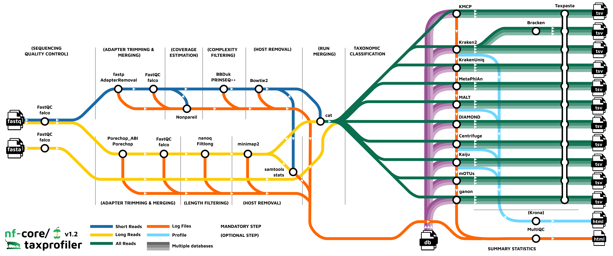

#  

[](https://nf-co.re/taxprofiler/results)[](https://doi.org/10.5281/zenodo.7728364)

[](https://www.nextflow.io/)
[](https://docs.conda.io/en/latest/)
[](https://www.docker.com/)
[](https://sylabs.io/docs/)
[](https://tower.nf/launch?pipeline=https://github.com/nf-core/taxprofiler)

[](https://nfcore.slack.com/channels/taxprofiler)[](https://twitter.com/nf_core)[](https://www.youtube.com/c/nf-core)

## Introduction

**nf-core/taxprofiler** is a bioinformatics best-practice analysis pipeline for taxonomic classification and profiling of shotgun metagenomic data. It allows for in-parallel taxonomic identification of reads or taxonomic abundance estimation with multiple classification and profiling tools against multiple databases, produces standardised output tables.

The pipeline is built using [Nextflow](https://www.nextflow.io), a workflow tool to run tasks across multiple compute infrastructures in a very portable manner. It uses Docker/Singularity containers making installation trivial and results highly reproducible. The [Nextflow DSL2](https://www.nextflow.io/docs/latest/dsl2.html) implementation of this pipeline uses one container per process which makes it much easier to maintain and update software dependencies. Where possible, these processes have been submitted to and installed from [nf-core/modules](https://github.com/nf-core/modules) in order to make them available to all nf-core pipelines, and to everyone within the Nextflow community!

On release, automated continuous integration tests run the pipeline on a full-sized dataset on the AWS cloud infrastructure. This ensures that the pipeline runs on AWS, has sensible resource allocation defaults set to run on real-world datasets, and permits the persistent storage of results to benchmark between pipeline releases and other analysis sources.The results obtained from the full-sized test can be viewed on the [nf-core website](https://nf-co.re/taxprofiler/results).

The nf-core/taxprofiler CI test dataset uses sequencing data from [Maixner et al. (2021) Curr. Bio.](https://doi.org/10.1016/j.cub.2021.09.031). The AWS full test dataset uses sequencing data and reference genomes from [Meslier (2022) _Sci. Data_](https://doi.org/10.1038/s41597-022-01762-z)

## Pipeline summary



1. Read QC ([`FastQC`](https://www.bioinformatics.babraham.ac.uk/projects/fastqc/) or [`falco`](https://github.com/smithlabcode/falco) as an alternative option)
2. Performs optional read pre-processing
   - Adapter clipping and merging (short-read: [fastp](https://github.com/OpenGene/fastp), [AdapterRemoval2](https://github.com/MikkelSchubert/adapterremoval); long-read: [porechop](https://github.com/rrwick/Porechop))
   - Low complexity and quality filtering (short-read: [bbduk](https://jgi.doe.gov/data-and-tools/software-tools/bbtools/), [PRINSEQ++](https://github.com/Adrian-Cantu/PRINSEQ-plus-plus); long-read: [Filtlong](https://github.com/rrwick/Filtlong))
   - Host-read removal (short-read: [BowTie2](http://bowtie-bio.sourceforge.net/bowtie2/); long-read: [Minimap2](https://github.com/lh3/minimap2))
   - Run merging
3. Supports statistics for host-read removal ([Samtools](http://www.htslib.org/))
4. Performs taxonomic classification and/or profiling using one or more of:
   - [Kraken2](https://ccb.jhu.edu/software/kraken2/)
   - [MetaPhlAn3](https://huttenhower.sph.harvard.edu/metaphlan/)
   - [MALT](https://uni-tuebingen.de/fakultaeten/mathematisch-naturwissenschaftliche-fakultaet/fachbereiche/informatik/lehrstuehle/algorithms-in-bioinformatics/software/malt/)
   - [DIAMOND](https://github.com/bbuchfink/diamond)
   - [Centrifuge](https://ccb.jhu.edu/software/centrifuge/)
   - [Kaiju](https://kaiju.binf.ku.dk/)
   - [mOTUs](https://motu-tool.org/)
   - [KrakenUniq](https://github.com/fbreitwieser/krakenuniq)
5. Perform optional post-processing with:
   - [bracken](https://ccb.jhu.edu/software/bracken/)
6. Standardises output tables ([`Taxpasta`](https://taxpasta.readthedocs.io))
7. Present QC for raw reads ([`MultiQC`](http://multiqc.info/))
8. Plotting Kraken2, Centrifuge, Kaiju and MALT results ([`Krona`](https://hpc.nih.gov/apps/kronatools.html))

## Quick Start

1. Install [`Nextflow`](https://www.nextflow.io/docs/latest/getstarted.html#installation) (`>=22.10.1`).

2. Install any of [`Docker`](https://docs.docker.com/engine/installation/), [`Singularity`](https://www.sylabs.io/guides/3.0/user-guide/) (you can follow [this tutorial](https://singularity-tutorial.github.io/01-installation/)), [`Podman`](https://podman.io/), [`Shifter`](https://nersc.gitlab.io/development/shifter/how-to-use/) or [`Charliecloud`](https://hpc.github.io/charliecloud/) for full pipeline reproducibility _(you can use [`Conda`](https://conda.io/miniconda.html) both to install Nextflow itself and also to manage software within pipelines. Please only use it within pipelines as a last resort; see [docs](https://nf-co.re/usage/configuration#basic-configuration-profiles))_.

3. Download the pipeline and test it on a minimal dataset with a single command:

   ```bash
   nextflow run nf-core/taxprofiler -profile test,YOURPROFILE --outdir <OUTDIR>
   ```

   Note that some form of configuration will be needed so that Nextflow knows how to fetch the required software. This is usually done in the form of a config profile (`YOURPROFILE` in the example command above). You can chain multiple config profiles in a comma-separated string.

   > - The pipeline comes with config profiles called `docker`, `singularity`, `podman`, `shifter`, `charliecloud` and `conda` which instruct the pipeline to use the named tool for software management. For example, `-profile test,docker`.
   > - Please check [nf-core/configs](https://github.com/nf-core/configs#documentation) to see if a custom config file to run nf-core pipelines already exists for your Institute. If so, you can simply use `-profile <institute>` in your command. This will enable either `docker` or `singularity` and set the appropriate execution settings for your local compute environment.
   > - If you are using `singularity`, please use the [`nf-core download`](https://nf-co.re/tools/#downloading-pipelines-for-offline-use) command to download images first, before running the pipeline. Setting the [`NXF_SINGULARITY_CACHEDIR` or `singularity.cacheDir`](https://www.nextflow.io/docs/latest/singularity.html?#singularity-docker-hub) Nextflow options enables you to store and re-use the images from a central location for future pipeline runs.
   > - If you are using `conda`, it is highly recommended to use the [`NXF_CONDA_CACHEDIR` or `conda.cacheDir`](https://www.nextflow.io/docs/latest/conda.html) settings to store the environments in a central location for future pipeline runs.

4. Start running your own analysis!

   ```console
   nextflow run nf-core/taxprofiler --input samplesheet.csv --databases database.csv --outdir <OUTDIR> --run_<TOOL1> --run_<TOOL1> -profile <docker/singularity/podman/shifter/charliecloud/conda/institute>
   ```

## Documentation

The nf-core/taxprofiler pipeline comes with documentation about the pipeline [usage](https://nf-co.re/taxprofiler/usage), [parameters](https://nf-co.re/taxprofiler/parameters) and [output](https://nf-co.re/taxprofiler/output).

## Credits

nf-core/taxprofiler was originally written by [James A. Fellows Yates](https://github.com/jfy133), [Moritz Beber](https://github.com/Midnighter), and [Sofia Stamouli](https://github.com/sofsam).

We thank the following people for their contributions to the development of this pipeline:

[Lauri Mesilaakso](https://github.com/ljmesi), [Tanja Normark](https://github.com/talnor), [Maxime Borry](https://github.com/maxibor),[Thomas A. Christensen II](https://github.com/MillironX), [Jianhong Ou](https://github.com/jianhong), [Rafal Stepien](https://github.com/rafalstepien), [Mahwash Jamy](https://github.com/mjamy), and the [nf-core/community](https://nf-co.re/community).

We also are grateful for the feedback and comments from:

- [Alex Hübner](https://github.com/alexhbnr)
- [LilyAnderssonLee](https://github.com/LilyAnderssonLee)

Credit and thanks also goes to [Zandra Fagernäs](https://github.com/ZandraFagernas) for the logo.

## Contributions and Support

If you would like to contribute to this pipeline, please see the [contributing guidelines](.github/CONTRIBUTING.md).

For further information or help, don't hesitate to get in touch on the [Slack `#taxprofiler` channel](https://nfcore.slack.com/channels/taxprofiler) (you can join with [this invite](https://nf-co.re/join/slack)).

## Citations

If you use nf-core/taxprofiler for your analysis, please cite it using the following doi: [10.5281/zenodo.7728364](https://doi.org/10.5281/zenodo.7728364)

An extensive list of references for the tools used by the pipeline can be found in the [`CITATIONS.md`](CITATIONS.md) file.

You can cite the `nf-core` publication as follows:

> **The nf-core framework for community-curated bioinformatics pipelines.**
>
> Philip Ewels, Alexander Peltzer, Sven Fillinger, Harshil Patel, Johannes Alneberg, Andreas Wilm, Maxime Ulysse Garcia, Paolo Di Tommaso & Sven Nahnsen.
>
> _Nat Biotechnol._ 2020 Feb 13. doi: [10.1038/s41587-020-0439-x](https://dx.doi.org/10.1038/s41587-020-0439-x).
