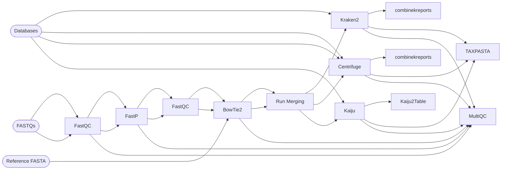

# nf-core/taxprofiler: Tutorials

This page provides a range of tutorials to help give you a bit more guidance on how to set up nf-core/taxprofiler runs in the wild.

## Simple Tutorial

In this tutorial we will run you through a simple set up of a small nf-core/taxprofiler run.
It assumes that you have basic knowledge of metagenomic classification input and output files.

### Preparation

#### Hardware

The datasets used should be small enough to run on your own laptop or a single server node.

If you wish to use a HPC cluster or cloud, and don't wish to use an 'interactive' session submitted to your scheduler, please see the [nf-core documentation](https://nf-co.re/docs/usage/configuration#introduction) on how to make a relevant config file.

You will need internet access and at least 1.5 GB of hardrive space.

#### Software

The tutorial assumes you are on a Unix based operating system, and have already installed Nextflow as well a software environment system such as [Conda](https://docs.conda.io/en/latest/miniconda.html), [Docker](https://www.docker.com/), or [Singularity/Apptainer](https://apptainer.org/).
The tutorial will use Docker, however you can simply replace references to `docker` with `conda`, `singularity`, or `apptainer` accordingly.

#### Data

First we will make a directory to run the whole tutorial in.

```bash
mkdir taxprofiler-tutorial
cd taxprofiler-tutorial/
```

We will use very small short-read (pre-subset) metagenomes used for testing.
nf-core/taxprofiler accepts FASTQ or FASTA files as input formats, however we will use FASTQ here as the more common format in taxonomic classification.
You can download these metagenomes with the following command.

```bash
curl -O https://raw.githubusercontent.com/nf-core/test-datasets/taxprofiler/data/fastq/ERX5474932_ERR5766176_1.fastq.gz
curl -O https://raw.githubusercontent.com/nf-core/test-datasets/taxprofiler/data/fastq/ERX5474932_ERR5766176_2.fastq.gz
curl -O https://raw.githubusercontent.com/nf-core/test-datasets/taxprofiler/data/fastq/ERX5474932_ERR5766176_B_1.fastq.gz
curl -O https://raw.githubusercontent.com/nf-core/test-datasets/taxprofiler/data/fastq/ERX5474932_ERR5766176_B_2.fastq.gz
```

In this tutorial we will demonstrate running with three different profilers, and in one of those cases, running the same database twice but with different parameters.
The database consists of two genomes of species known to be present in the metagenomes.
You can download the databases for Kraken2, Centrifuge, and Kaiju with the following commands.

```bash
curl -O https://raw.githubusercontent.com/nf-core/test-datasets/taxprofiler/data/database/kraken2/testdb-kraken2.tar.gz
curl -O https://raw.githubusercontent.com/nf-core/test-datasets/taxprofiler/data/database/centrifuge/test-db-centrifuge.tar.gz
curl -O https://raw.githubusercontent.com/nf-core/test-datasets/taxprofiler/data/database/kaiju/kaiju.tar.gz
```

To demonstrate that nf-core/taxprofiler can also accept databases as uncompressed folders, we can extract one of them.

```bash
tar -xzf kaiju.tar.gz
```

:::note
You must provide these databases pre-built to the pipeline, nf-core/taxprofiler neither comes with default databases nor can generate databases for you.
For guidance on how to build databases, see the [Retrieving databases or building custom databases](#retrieving-databases-or-building-custom-databases) tutorial.
:::

Finally, an important step of any metagenomic classification is to remove contamination.
Contamination can come from many places, typically from the host of a host-associated sample, however this can also come from laboratory processing samples.
A common contaminant in Illumina sequencing is a spike-in control of the genome of PhiX virus, which we can download with the following command.

```bash
curl -O https://ftp.ncbi.nlm.nih.gov/genomes/all/GCF/000/819/615/GCF_000819615.1_ViralProj14015/GCF_000819615.1_ViralProj14015_genomic.fna.gz
```

### Preparing Input

#### Sample sheet

You provide the sequencing data FASTQ files to nf-core/taxprofiler via a input 'sample sheet' `.csv` file.
This is a 6 column table, that includes sample and library names, instrument platform, and paths to the sequencing data.

Open a text editor, and create a file called `samplesheet.csv`.
Copy and paste the following lines into the file and save it.

```csv title="samplesheet.csv"
sample,run_accession,instrument_platform,fastq_1,fastq_2,fasta
ERX5474932,ERR5766176,ILLUMINA,ERX5474932_ERR5766176_1.fastq.gz,ERX5474932_ERR5766176_2.fastq.gz,
ERX5474932,ERR5766176_B,ILLUMINA,ERX5474932_ERR5766176_B_1.fastq.gz,ERX5474932_ERR5766176_B_2.fastq.gz,
```

Here we have specified two libraries of the same sample, that they were sequencing on Illumina platforms, and the paths to the FASTQ files.
If you had placed your FASTQ files elsewhere, you would give the full path (i.e., with relevant directories) to the `fastq_1`, `fastq_2` and `fasta` columns.

#### Database sheet

For the database(s), you also supply these via a `.csv` file.
This 4 (or 5) column table contains the tool the database has been built for, a database name, the parameters you wish reads to be queried against the given database with, an optional column to distinguish between short- and long-read databases, and a path to a `.tar.gz` archive file or a directory containing the database files.

Open a text editor, and create a file called `database.csv`.
Copy and paste the following csv file into the file and save it.

```csv title="database.csv"
tool,db_name,db_params,db_type,db_path
kraken2,db1,--quick,short,testdb-kraken2.tar.gz
centrifuge,db2,,short,test-db-centrifuge.tar.gz
centrifuge,db2_trimmed,--trim5 2 --trim3 2,long,test-db-centrifuge.tar.gz
kaiju,db3,,short;long,kaiju/
```

You can see here we have specified the Centrifuge database twice, to allow comparison of different settings.
We have also specified different profiling parameters depending on whether a database is for short-read or long-read use.
If we don't specify this, the pipeline will assume all databases (and their settings specified in `db_params`!) will be applicable for both short and long read data.
Note that the each database of the same tool has a unique name.
Furthermore, while the Kraken2 and Centrifuge databases have been supplied as `.tar.gz` archives, the Kaiju database has been supplied as a directory.

### Running the pipeline

Now that we have the sequencing reads (in FASTQ format), the databases (directory or `.tar.gz`), and a reference genome (FASTA, optionally gzipped), we can now run them with the pipeline. The following command will perform short read quality control, remove contaminant reads, merge multiple libraries for each sample, run the three profilers, and finally generate standardised profiles.

```bash
nextflow run nf-core/taxprofiler -r 1.1.0 -profile docker \
--input samplesheet.csv --databases database.csv --outdir ./results \
--perform_shortread_qc \
--perform_shortread_hostremoval --hostremoval_reference GCF_000819615.1_ViralProj14015_genomic.fna.gz \
--perform_runmerging --save_runmerged_reads \
--run_centrifuge --run_kaiju --run_kraken2 \
--run_profile_standardisation
```

:::info
With all Docker containers pre-downloaded, this run took 2 minutes and 31 seconds on a laptop running Ubuntu 22.04.2 with 32 GB RAM and 16 CPUs.
If you are running nf-core/taxprofiler for the first time, expect this command to take longer as Nextflow will have to download each software container for each step of the pipeline.
:::

To break down each line of the command:

- Tell Nextflow to run nf-core/taxprofiler with the particular version and using the Docker container system
- Specify the input and outputs, i.e., paths to the `samplesheet.csv`, `database.csv`, and directory where to save the results
- Turn on basic quality control of input reads: adapter clipping, length filtering, etc
- Turn on the removal of host or contaminant reads, and specify the path to reference genome of this
- Turn on run merging, i.e., combine the processed input reads of the multiple libraries into each sample, and save these reads (e.g. for downstream use)
- Turn on the different taxonomic profiling tools you wish to use
- Turn on profile standardisation and multi-sample taxon tables
- (Optional) provide a _cap_ to the maximum amount of resources each step/job of the pipeline can use

:::warning
The pipeline runs occasionally fail due to a particular step of the pipeline requesting more resources than you have on your system. To avoid these failures, you can tell Nextflow to set a cap pipeline-step resource requests against a list called `resourceLimits` specified in Nextflow config file. These should represent the maximum possible resources of a machine or node. To learn how to increase computational resource to the pipeline, see the central [nf-core documentation](https://nf-co.re/docs/usage/configuration).
:::

The pipeline run can be represented (in a simplified format!) as follows



:::tip{title=""}
We hope you see the benefit of using pipelines for such a task!
:::

### Output

In the resulting directory `results/` you will find a range of directories.

```tree
results/
├── bowtie2
├── centrifuge
├── fastp
├── fastqc
├── kaiju
├── kraken2
├── multiqc
├── pipeline_info
├── run_merging
├── samtools
└── taxpasta
```

To follow the same order as the command construction above

- Pipeline run report is found in `multiqc/` and resource statistics in `pipeline_info`
- Short-read QC results are found in `fastqc/` and `fastp/`
- Host/contaminant removal results are found in `bowtie2/` and `samtools/`
- Lane merged preprocessed reads are found in `run_merging/`
- Raw profiling results are found in `kraken2/`, `centrifuge/`, and `kaiju/`
- Standardised profiles for all profiling tools and databases are found in `taxpasta`

:::info
Within each classifier results directory, there will be one directory and 'combined samples table' per database.
:::

:::info
For read-preprocessing steps, only log files are stored in the `results/` directories by default. Refer to the parameters tab of the [nf-core/taxprofiler documentation](https://nf-co.re/taxprofiler/) for more options.
:::

The general 'workflow' of going through the results will typically be reviewing the `multiqc/multiqc_report.html` file to get general statistics of the entire run, particularly of the preprocessing.
You would then use the taxon tables in the `taxpasta/` directory for downstream analysis, but referring to the classifier specific results directories when you require more detailed information on each classification.

Detailed descriptions of all results files can be found in the output tab of the [nf-core/taxprofiler documentation](https://nf-co.re/taxprofiler/).

### Clean up

Once you have completed the tutorial, you can run the following command to delete all downloaded and output files.

```bash
rm -r taxprofiler-tutorial/
```

:::warning
Don't forget to change out of the directory above before trying to delete it!
:::

## Retrieving databases or building custom databases

Not all taxonomic profilers provide ready-made or default databases. Here we will give brief guidance on how to build custom databases for each supported taxonomic profiler.

You should always consult the documentation of each tool for more information, as here we only provide short minimal-tutorials as quick reference guides (with no guarantee they are up to date).

The following tutorials assumes you already have the tool available (e.g. installed locally, or via conda, docker etc.), and you have already downloaded the FASTA files you wish to build into a database.

### Bracken custom database

Bracken does not require an independent database but rather builds upon Kraken2 databases. [The pre-built Kraken2 databases hosted by Ben Langmead](https://benlangmead.github.io/aws-indexes/k2) already contain the required files to run Bracken.

However, to build custom databases, you will need a Kraken2 database, the (average) read lengths (in bp) of your sequencing experiment, the K-mer size used to build the Kraken2 database, and Kraken2 available on your machine.

```bash
bracken-build -d <KRAKEN_DB_DIR> -k <KRAKEN_DB_KMER_LENGTH> -l <READLENGTH>
```

:::tip
You can speed up database construction by supplying the threads parameter (`-t`).
:::

:::tip
If you do not have Kraken2 in your `$PATH` you can point to the binary with `-x /<path>/<to>/kraken2`.
:::

<details markdown="1">
<summary>Expected files in database directory</summary>

- `bracken`
  - `hash.k2d`
  - `opts.k2d`
  - `taxo.k2d`
  - `database100mers.kmer_distrib`
  - `database150mers.kmer_distrib`

</details>

You can follow Bracken [tutorial](https://ccb.jhu.edu/software/bracken/index.shtml?t=manual) for more information.

### Centrifuge custom database

To build a custom Centrifuge database, a user needs to download taxonomy files, make a custom `seqid2taxid.map` and combine the fasta files together.

In total, you need four components: a tab-separated file mapping sequence IDs to taxonomy IDs (`--conversion-table`), a tab-separated file mapping taxonomy IDs to their parents and rank, up to the root of the tree (`--taxonomy-tree`), a pipe-separated file mapping taxonomy IDs to a name (`--name-table`), and the reference sequences.

An example of custom `seqid2taxid.map`:

```csv title="seqid2taxid.map"
  NC_001133.9 4392
  NC_012920.1 9606
  NC_001134.8 4392
  NC_001135.5 4392
```

```bash
centrifuge-download -o taxonomy taxonomy
cat *.{fa,fna} > input-sequences.fna
centrifuge-build -p 4 --conversion-table seqid2taxid.map --taxonomy-tree taxonomy/nodes.dmp --name-table taxonomy/names.dmp input-sequences.fna taxprofiler_cf
```

<details markdown="1">
<summary>Expected files in database directory</summary>

- `centrifuge`
  - `<database_name>.<number>.cf`
  - `<database_name>.<number>.cf`
  - `<database_name>.<number>.cf`
  - `<database_name>.<number>.cf`

</details>

For the Centrifuge custom database documentation, see [here](https://ccb.jhu.edu/software/centrifuge/manual.shtml#custom-database).

### DIAMOND custom database

To create a custom database for DIAMOND, the user should download and unzip the NCBI's taxonomy files and the input FASTA files.

The download and build steps are as follows:

```bash
wget ftp://ftp.ncbi.nlm.nih.gov/pub/taxonomy/taxdmp.zip
unzip taxdmp.zip

## warning: large file!
wget ftp://ftp.ncbi.nlm.nih.gov/pub/taxonomy/accession2taxid/prot.accession2taxid.FULL.gz

## warning: takes a long time!
cat ../raw/*.faa | diamond makedb -d testdb-diamond --taxonmap prot.accession2taxid.FULL.gz --taxonnodes nodes.dmp --taxonnames names.dmp

## clean up
rm *dmp *txt *gz *prt *zip
```

<details markdown="1">
<summary>Expected files in database directory</summary>

- `diamond`
  - `<database_name>.dmnd`

</details>

A detailed description can be found [here](https://github.com/bbuchfink/diamond/wiki/1.-Tutorial).

### Kaiju custom database

A number of kaiju pre-built indexes for reference datasets are maintained by the developers of kaiju and made available on the [kaiju website](https://bioinformatics-centre.github.io/kaiju/downloads.html). These databases can directly be used to run the workflow with Kaiju.

In case the databases above do not contain your desired libraries, you can build a custom kaiju database. To build a kaiju database, you need three components: a FASTA file with the protein sequences, the NCBI taxonomy dump files, and you need to define the uppercase characters of the standard 20 amino acids you wish to include.

:::warning
The headers of the protein fasta file must be numeric NCBI taxon identifiers of the protein sequences.
:::

To download the NCBI taxonomy files, please run the following commands:

```bash
wget https://ftp.ncbi.nlm.nih.gov/pub/taxonomy/new_taxdump/new_taxdump.zip
unzip new_taxdump.zip
```

To build the database, run the following command (the contents of taxdump must be in the same location where you run the command):

```bash
kaiju-mkbwt -a ACDEFGHIKLMNPQRSTVWY -o proteins proteins.faa
kaiju-mkfmi proteins
```

:::tip
You can speed up database construction by supplying the threads parameter (`-t`).
:::

<details markdown="1">
<summary>Expected files in database directory</summary>

- `kaiju`
  - `kaiju_db_*.fmi`
  - `nodes.dmp`
  - `names.dmp`

</details>

For the Kaiju database construction documentation, see [here](https://github.com/bioinformatics-centre/kaiju#custom-database).

### Kraken2 custom database

A number of database indexes have already been generated and maintained by [@BenLangmead Lab](https://github.com/BenLangmead), see [here](https://benlangmead.github.io/aws-indexes/k2). These databases can directly be used to run the workflow with Kraken2 as well as Bracken.

In case the databases above do not contain your desired libraries, you can build a custom Kraken2 database. This requires two components: a taxonomy (consisting of `names.dmp`, `nodes.dmp`, and `*accession2taxid`) files, and the FASTA files you wish to include.

To pull the NCBI taxonomy, you can run the following:

```bash
kraken2-build --download-taxonomy --db <YOUR_DB_NAME>
```

You can then add your FASTA files with the following build command.

```bash
kraken2-build --add-to-library *.fna --db <YOUR_DB_NAME>
```

You can repeat this step multiple times to iteratively add more genomes prior building.

Once all genomes are added to the library, you can build the database (and optionally clean it up):

```bash
kraken2-build --build --db <YOUR_DB_NAME>
kraken2-build --clean --db <YOUR_DB_NAME>
```

You can then add the `<YOUR_DB_NAME>/` path to your nf-core/taxprofiler database input sheet.

<details markdown="1">
<summary>Expected files in database directory</summary>

- `kraken2`
  - `opts.k2d`
  - `hash.k2d`
  - `taxo.k2d`

</details>

You can follow the Kraken2 [tutorial](https://github.com/DerrickWood/kraken2/blob/master/docs/MANUAL.markdown#custom-databases) for a more detailed description.

### KrakenUniq custom database

For any KrakenUniq database, you require: taxonomy files, the FASTA files you wish to include, a `seqid2mapid` file, and a k-mer length.

First you must make a `seqid2taxid.map` file which is a two column text file containing the FASTA sequence header and the NCBI taxonomy ID for each sequence:

```
MT192765.1  2697049
```

Then make a directory (`<DB_DIR_NAME>/`), containing the `seqid2taxid.map` file, and your FASTA files in a subdirectory called `library/` (these FASTA files can be symlinked). You must then run the `taxonomy` command on the `<DB_DIR_NAME>/` directory, and then build it.

```bash
mkdir -p <DB_DIR_NAME>/library
mv `seqid2taxid.map` <DB_DIR_NAME>/
mv *.fna  <DB_DIR_NAME>/library
krakenuniq-download --db <DB_DIR_NAME>  taxonomy
krakenuniq-build --db <DB_DIR_NAME> --kmer-len 31
```

:::tip
You can speed up database construction by supplying the threads parameter (`--threads`) to `krakenuniq-build`.
:::

<details markdown="1">
<summary>Expected files in database directory</summary>

- `krakenuniq`
  - `opts.k2d`
  - `hash.k2d`
  - `taxo.k2d`
  - `database.idx`
  - `taxDB`

</details>

Please see the [KrakenUniq documentation](https://github.com/fbreitwieser/krakenuniq#database-building) for more information.

### MALT custom database

To build a MALT database, you need the FASTA files to include, and an (unzipped) [MEGAN mapping 'db' file](https://software-ab.informatik.uni-tuebingen.de/download/megan6/) for your FASTA type. In addition to the input directory, output directory, and the mapping file database, you also need to specify the sequence type (DNA or Protein) with the `-s` flag.

```bash
malt-build -i <path>/<to>/<fasta>/*.{fna,fa,fasta} -a2t <path>/<to>/<map>.db -d <YOUR_DB_NAME>/  -s DNA
```

You can then add the `<YOUR_DB_NAME>/` path to your nf-core/taxprofiler database input sheet.

:::warning
MALT generates very large database files and requires large amounts of RAM. You can reduce both by increasing the step size `-st` (with a reduction in sensitivity).
:::

:::tip
MALT-build can be multi-threaded with `-t` to speed up building.
:::

<details markdown="1">
<summary>Expected files in database directory</summary>

- `malt`
  - `ref.idx`
  - `taxonomy.idx`
  - `taxonomy.map`
  - `index0.idx`
  - `table0.idx`
  - `table0.db`
  - `ref.inf`
  - `ref.db`
  - `taxonomy.tre`

</details>

See the [MALT manual](https://software-ab.informatik.uni-tuebingen.de/download/malt/manual.pdf) for more information.

### MetaPhlAn custom database

MetaPhlAn does not allow (easy) construction of custom databases. Therefore we recommend to use the prebuilt database of marker genes that is provided by the developers.

To perform this task, ensure that you have installed `MetaPhlAn` on your machine. Keep in mind that each version of MetaPhlAn aligns with a specific version of the database. Therefore, if you download the MetaPhlAn3 database, remember to include `--mpa3` as a parameter for the database in the `--databases` CSV file.

```bash
metaphlan --install --bowtie2db <YOUR_DB_NAME>/
```

You can then add the `<YOUR_DB_NAME>/` path to your nf-core/taxprofiler database input sheet.

:::warning
It is generally not recommended to modify this database yourself, thus this is currently not supported in the pipeline. However, it is possible to customise the existing database by adding your own marker genomes following the instructions [here](https://github.com/biobakery/MetaPhlAn/wiki/MetaPhlAn-4#customizing-the-database).
:::

:::note
If using your own database is relevant for you, please contact the nf-core/taxprofiler developers on the [nf-core slack](https://nf-co.re/join) and we will investigate supporting this.
:::

<details markdown="1">
<summary>Expected files in database directory</summary>

- `metaphlan4`
  - `mpa_vJan21_TOY_CHOCOPhlAnSGB_202103.pkl`
  - `mpa_vJan21_TOY_CHOCOPhlAnSGB_202103.fna.bz2`
  - `mpa_vJan21_TOY_CHOCOPhlAnSGB_202103.1.bt2l`
  - `mpa_vJan21_TOY_CHOCOPhlAnSGB_202103.2.bt2l`
  - `mpa_vJan21_TOY_CHOCOPhlAnSGB_202103.3.bt2l`
  - `mpa_vJan21_TOY_CHOCOPhlAnSGB_202103.4.bt2l`
  - `mpa_vJan21_TOY_CHOCOPhlAnSGB_202103.rev.1.bt2l`
  - `mpa_vJan21_TOY_CHOCOPhlAnSGB_202103.rev.2.bt2l`
  - `mpa_latest`

</details>

More information on the MetaPhlAn database can be found [here](https://github.com/biobakery/MetaPhlAn/wiki/MetaPhlAn-4#Pre-requisites).

### mOTUs custom database

mOTUs does not provide the ability to construct custom databases. Therefore we recommend to use the the prebuilt database of marker genes provided by the developers.

:::warning
**Do not change the directory name of the resulting database if moving to a central location** The database name of `db_mOTU/` is hardcoded in the mOTUs tool
:::

To do this you need to have `mOTUs` installed on your machine.

```bash
motus downloadDB
```

Then supply the `db_mOTU/` path to your nf-core/taxprofiler database input sheet.

:::warning
The `db_mOTU/` directory may be downloaded to somewhere in your Python's `site-package` directory. You will have to find this yourself as the exact location varies depends on installation method.
:::

More information on the mOTUs database can be found [here](https://motu-tool.org/installation.html).

#### ganon custom database

To build a custom ganon database you need two components: the FASTA files you wish to include, and the file extension of those FASTA files.

:::tip
You can also use [`ganon build`](https://pirovc.github.io/ganon/default_databases/) to download and generate pre-defined databases for you.
:::

You can optionally include your own taxonomy files, however `ganon build-custom` will download these for you if not provided.

```bash
ganon build-custom --threads 4 --input *.fa --db-prefix <YOUR_DB_NAME>
```

You can then add the `<YOUR_DB_NAME>/` path to your nf-core/taxprofiler database input sheet.

:::tip
`ganon build-custom` can be multi-threaded with `-t` to speed up building.
:::

<details markdown="1">
<summary>Expected files in database directory</summary>

- `ganon`
  - `*.ibf` or `.hibf`
  - `*.tax`

</details>

More information on custom ganon database construction can be found [here](https://pirovc.github.io/ganon/custom_databases/).

#### KMCP custom database

To build a KMCP database you need four components: the FASTA files you wish to include in gzip-compressed format and one genome per file with the reference identifier in the file name, the taxid mapping file, NCBI taxonomy dump files (names.dmp, nodes.dmp), and the range of k-mers to build the database with.

1. You need to compute the k-mers with [`kmcp compute`](https://bioinf.shenwei.me/kmcp/usage/#compute) and by providing as input the FASTA files you wish to include.
2. You need to build index for k-mers with [`kmcp index`](https://bioinf.shenwei.me/kmcp/usage/#index) by providing as input the output of `kmcp compute`

For example

```bash
kmcp compute -k 21 -n 10 -l 150 -O <OUTDIR_NAME>  <path>/<to>/<fasta>/*.{fna,fa,fasta}
kmcp index -I <OUTDIR_NAME>/ --threads 8 --num-hash 1 --false-positive-rate 0.3 --out-dir <YOUR_DB_NAME>/
```

You can then add the `<YOUR_DB_NAME>/` path to your nf-core/taxprofiler database input sheet.

<details markdown="1">
<summary>Expected files in database directory</summary>

- `kmcp`
  - `.unik`
  - `_info.txt`
  - `*.kmcp/`
  - `__db.yml`

</details>

More information on custom KMCP database construction can be found [here](https://bioinf.shenwei.me/kmcp/database/#building-custom-databases).

#### sylph custom database

To build a sylph database, it only requires fasta files.

```bash
sylph sketch genomes/*.fa.gz
```

If all genomes are in the same file, you can run:

```bash
sylph sketch all_genomes.fa
```

By default, the output database will be named `database.syldb`. If you prefer a custom name, please use `--out-name-db <YOUR_DB_NAME>` flag.

<details markdown="1">
<summary>Expected files in database directory</summary>

- `sylph`
  - `database/<custom_name>.syldb`
  </details>

More information on custom sylph database construction can be found [here](https://sylph-docs.github.io/sylph-cookbook/#database-sketching-options).

Classification using the sylph classifier consists of two steps:

1. running the `sylph profile` command
2. running the `sylph-tax taxprof` command

The second `sylph-tax taxprof` command also requires a taxonomy file that you must provide.
You can create your own taxonomy metadata file via a two-column TSV file:

- Column 1: the name of your genome's FASTA file
- Column 2: a semicolon-delimited taxonomy string.

For example:

```bash
GCA_000005845.2	d__Bacteria;p__Pseudomonadota;c__Gammaproteobacteria;o__Enterobacterales;f__Enterobacteriaceae;g__Escherichia;s__Escherichia
GCA_000006805.1	d__Archaea;p__Halobacteriota;c__Halobacteria;o__Halobacteriales;f__Halobacteriaceae;g__Halobacterium;s__Halobacterium
GCA_000006985.1	d__Bacteria;p__Bacteroidota;c__Chlorobia;o__Chlorobiales;f__Chlorobiaceae;g__Chlorobaculum;s__Chlorobaculum
GCA_000007105.1	d__Bacteria;p__Pseudomonadota;c__Alphaproteobacteria;o__Sphingomonadales;f__Sphingomonadaceae;g__Zymomonas;s__Zymomonas
GCA_000007185.1	d__Archaea;p__Methanobacteriota;c__Methanopyri;o__Methanopyrales;f__Methanopyraceae;g__Methanopyrus;s__Methanopyrus
GCA_000007225.1	d__Archaea;p__Thermoproteota;c__Thermoprotei;o__Thermoproteales;f__Thermoproteaceae;g__Pyrobaculum;s__Pyrobaculum
```

More information on custom taxonomies can be found [here](https://sylph-docs.github.io/sylph-tax-custom-taxonomies/)

#### Melon custom database

Melon does not provide the ability to construct custom databases.
Therefore we recommend to use the the prebuilt database of marker genes provided by the developers.

The pre-built database is specifically designed for long-read metagenomic data.
Sequences from either NCBI or GTDB can be used to build the database.

To use the Melon database, you need to download one of pre-built databases from the [Melon GitHub repository](https://github.com/xinehc/melon#database-setup).

After downloading the marker gene set provided in the github repository, you will need to have `DIAMOND` and `minimap2` installed to build the database.

```bash
## if you encounter memory issue please consider manually lowering cpu_count or simply set cpu_count=1
cpu_count=$(python -c 'import os; print(os.cpu_count())')

diamond makedb --in database/prot.fa --db database/prot --quiet
ls database/nucl.*.fa | sort | xargs -P $cpu_count -I {} bash -c '
    filename=${1%.fa*};
    filename=${filename##*/};
    minimap2 -x map-ont -d database/$filename.mmi ${1} 2> /dev/null;
    echo "Indexed <database/$filename.fa>.";' - {}

## remove unnecessary files to save space
rm -rf database/*.fa
```

You can then add the `<YOUR_DB_NAME>/` path to your nf-core/taxprofiler database input sheet.

<details markdown="1">
<summary>Expected files in database directory</summary>

- `melon`
  - `metadata.tsv`
  - `nucl.archaea.l15e.mmi`
  - `nucl.archaea.s19e.mmi`
  - `nucl.bacteria.l11.mmi`
  - `nucl.bacteria.l27.mmi`
  - `nucl.bacteria.s7.mmi`
  - `nucl.archaea.l10e.mmi`
  - `nucl.archaea.l18e.mmi`
  - `nucl.archaea.s28e.mmi`
  - `nucl.archaea.s3ae.mmi`
  - `nucl.bacteria.l20.mmi`
  - `nucl.bacteria.s2.mmi`
  - `prot.dmnd`

</details>

More information on the Melon database can be found [here](https://github.com/xinehc/melon#database-setup).
